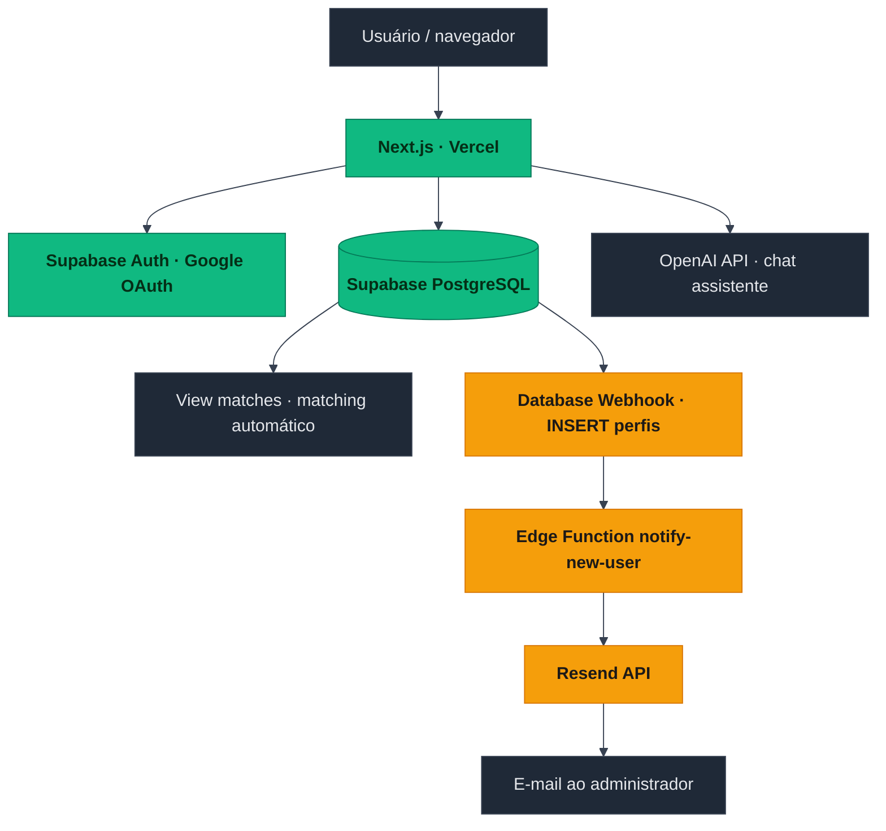
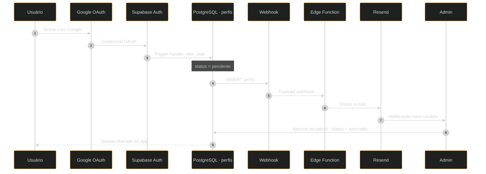
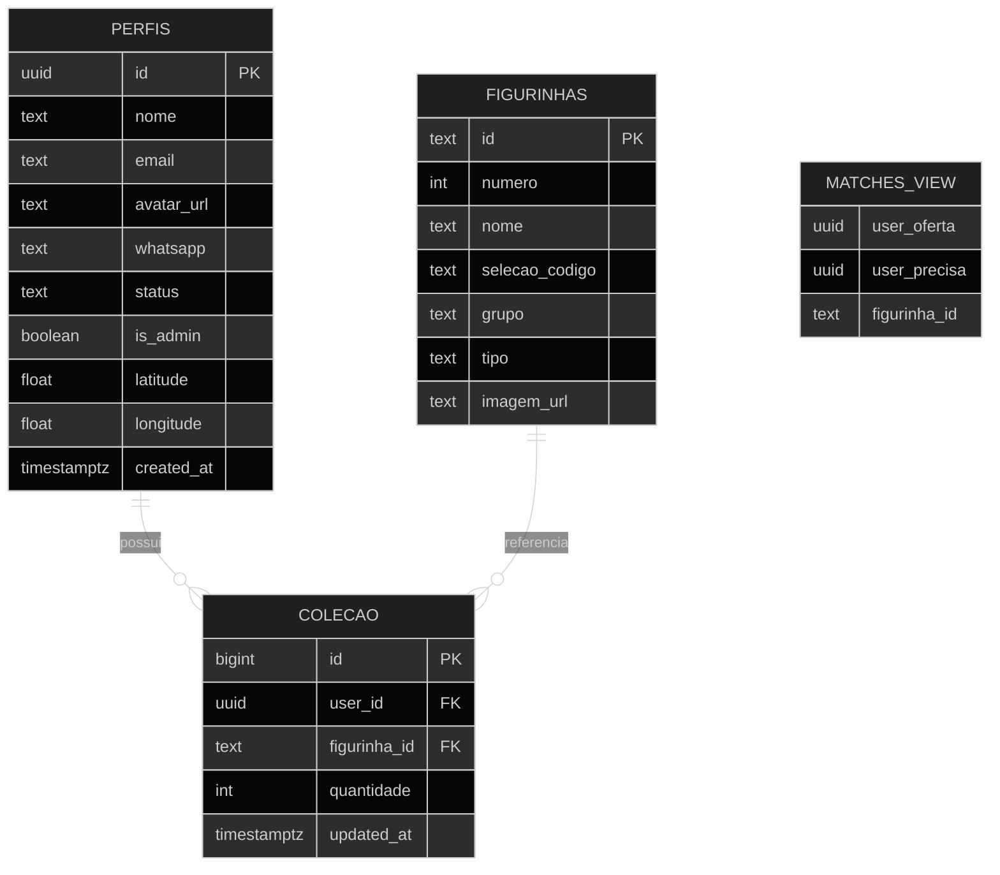
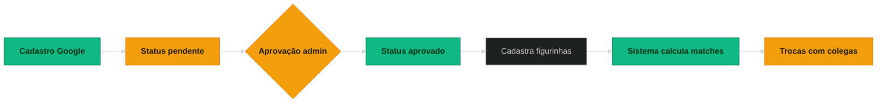

# **CollectHub**

**Plataforma de troca de figurinhas da Copa do Mundo FIFA 2026** 🏆

 

 

## Sobre o projeto

**CollectHub** (anteriormente *Stickermatch*) é uma aplicação web **privada** para organizar trocas de figurinhas do álbum oficial **Panini — Copa do Mundo FIFA 2026**, pensada para um **grupo fechado** de cerca de **20–30** colegas e amigos.

O acesso é feito com **conta Google**; novos cadastros ficam **pendentes** até um **administrador** aprovar manualmente no painel interno — assim só entra quem pertence ao grupo.

## Funcionalidades

| | |
|---|---|
| 🎴 | **Catálogo completo** com **980 figurinhas** da Copa 2026 |
| 📦 | **Modo Pacote** para entrada rápida de figurinhas |
| 🤝 | **Matches automáticos** entre colecionadores (view derivada das coleções) |
| 🤖 | **Assistente IA** (*Albu-AI*) integrado ao chat (**OpenAI API**, modelo configurável) |
| 🌙 | **Dark mode** como base + alternância de tema claro |
| 📱 | **PWA** — instalável no celular |
| 🔐 | **Acesso controlado** com aprovação manual pelo admin |
| 📍 | **Distância** entre colecionadores (**geolocalização opcional**) |
| 📧 | **E-mail ao admin** quando um novo usuário entra na fila de aprovação |
| 🏆 | **Álbum** organizado por **grupos da Copa** (A–L) com bandeiras e barras de progresso |

## Arquitetura / fluxo do sistema

### Diagrama 1 — Arquitetura geral

### Diagrama 2 — Fluxo de cadastro e aprovação

## Stack técnica

| Categoria | Tecnologia | Uso |
|-----------|------------|-----|
| Frontend | Next.js 14, TypeScript, Tailwind CSS | Interface web e PWA |
| Backend | Supabase (PostgreSQL) | Dados, Auth, RLS, webhooks |
| Auth | Google OAuth via Supabase | Login |
| IA | OpenAI API | Assistente de chat contextual (`/api/chat`) |
| E-mail | Resend · domínio collecthub.app | Notificações de novos usuários |
| Deploy | Vercel | CI/CD ao dar push no Git |
| Edge Functions | Supabase · runtime Deno | `notify-new-user` (e-mail via Resend) |

## Modelo de dados (simplificado)

*`matches` é uma **view** SQL derivada de `colecao` + `figurinhas`, não uma tabela física.*

## Fluxo de negócio

## Acesso e ambiente

| | |
|---|---|
| **URL** | [collecthub.app](https://collecthub.app) |
| **Login** | Conta Google do grupo autorizado |
| **Aprovação** | Manual pelo administrador após o primeiro acesso |
| **Depois da aprovação** | Uso completo (álbum, matches, chat, perfil, etc.) |

## Variáveis de ambiente

Valores **não** devem ser commitados; use `.env.local` (local) e o painel da **Vercel** / secrets das **Edge Functions** em produção.

| Variável | Onde usar | Descrição |
|----------|-----------|-----------|
| `NEXT_PUBLIC_SUPABASE_URL` | App Next.js | URL do projeto Supabase |
| `NEXT_PUBLIC_SUPABASE_ANON_KEY` | App Next.js | Chave pública (anon) para o cliente |
| `SUPABASE_SERVICE_ROLE_KEY` | Servidor apenas | Service role — **nunca** expor no browser |
| `OPENAI_API_KEY` | Servidor (`/api/chat`) | Chave da API OpenAI do assistente |
| `OPENAI_CHAT_MODEL` | Servidor (opcional) | Modelo de chat (ex.: override do padrão) |
| `RESEND_API_KEY` | Secret da Edge Function Supabase | Envio de e-mail via Resend |
| `NOTIFICATION_EMAIL` | Secret da Edge Function Supabase | Destino das notificações de novo usuário |
| `SUPABASE_DB_PASSWORD` / `DATABASE_URL` | Dev local (opcional) | Migrações ou scripts contra o Postgres |

Veja também `.env.example` na raiz do repositório.

Feito com 💚 para a Copa do Mundo 2026 🏆  
 
<a href="https://collecthub.app"><strong>collecthub.app</strong></a>

